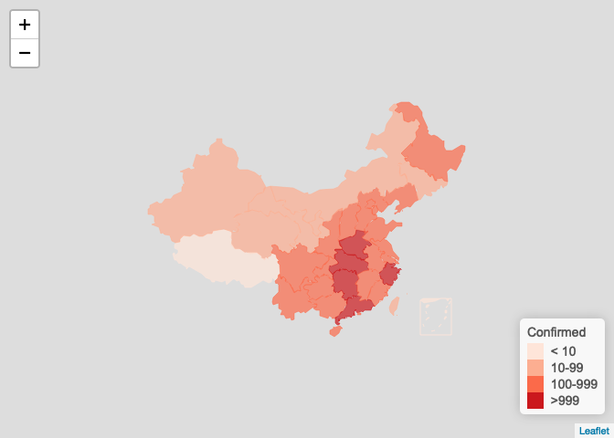
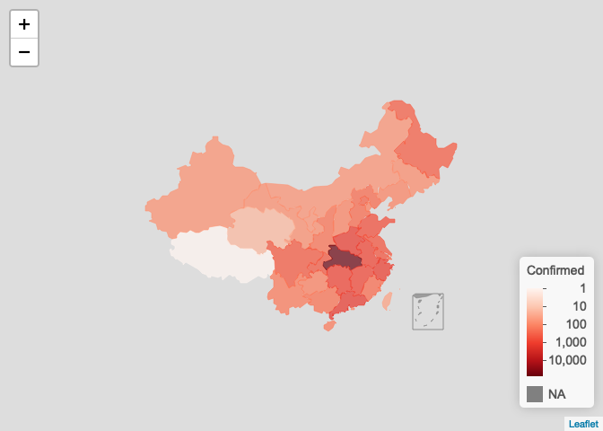
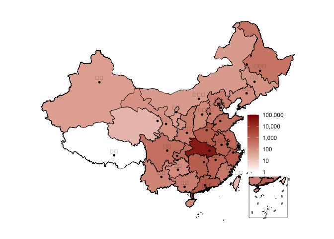
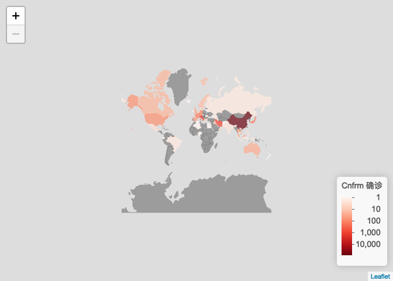

ncovr: Read and process nCoV data 新型冠状病毒数据获取和可视化
================
2020-03-01

这是一个 R 语言包，使用教程详见 <https://openr.pzhao.org/zh/tags/ncovr/>。这里是个简介。

ncovr 包是方便 R 用户获取新型冠状病毒（2019-nCoV）数据而开发的，后续增添了数据处理、建模、可视化等功能。

## 数据获取途径

ncovr 包获取数据的主要途径是
[BlankerL/DXY-2019-nCoV-Crawler](https://github.com/BlankerL/DXY-2019-nCoV-Crawler)。这个项目提供了
api 接口和 csv 文件。为了减轻 api 的流量压力， ncovr 每天将每天自动从这个 api 读一次数据，保存成 R 语言直接读取的
.RDS 格式，方便 R 语言用户调用。详见下面的示例。

## 安装

1.  安装 R。在 [CRAN](http://cran.r-project.org) 上选择适合你操作系统的安装包来安装。

2.  安装 remotes 包：`install.packages('remotes')`

3.  安装 ncovr
    包：`remotes::install_github('pzhaonet/ncovr')`

## 获取数据

``` r
Sys.setlocale('LC_CTYPE', 'Chinese') # windows 用户设置中文环境
```

    ## Warning in Sys.setlocale("LC_CTYPE", "Chinese"): OS reports request to set
    ## locale to "Chinese" cannot be honored

    ## [1] ""

``` r
require("ncovr")
```

    ## Loading required package: ncovr

``` r
require("leafletCN")
```

    ## Loading required package: leafletCN

``` r
ncov <- get_ncov() # 读取 RDS数据（推荐）

# get_ncov(method = 'csv') # 从 csv 文件读取（推荐）
# get_ncov(method = 'api') # 从 api 接口读取
```

## 国家地图:省级疫情图

leaflet

``` r
plot_map(ncov$area)
```

    ## Warning: Setting row names on a tibble is deprecated.

<!-- -->

``` r
# log scale
plot_map(ncov$area, scale = "log")
```

    ## Warning: Setting row names on a tibble is deprecated.

<!-- -->

ggplot

``` r
library(ggplot2)
ncov$area$date <- as.Date(ncovr:::conv_time(ncov$area$updateTime))
choose_date <- "2020-02-10"
x <- ncov$area[ncov$area$date <= as.Date(choose_date), ]
x <- x[!duplicated(x$provinceName), ]
plot_ggmap(x)
```

    ## Parsed with column specification:
    ## cols(
    ##   province = col_character(),
    ##   city = col_character(),
    ##   long = col_double(),
    ##   lat = col_double()
    ## )

<!-- -->

## 世界地图:各国疫情图

``` r
ncov$area$date <- as.Date(ncovr:::conv_time(ncov$area$updateTime))
ncov$area <- ncov$area[rev(order(ncov$area$date)), ]

ncov_date <- as.character(Sys.Date())
y <- ncov$area[ncov$area$date <= as.Date(ncov_date), ]
y <- y[!duplicated(y$provinceName), ]

countryname <- data.frame(
  ncovr = c("United Kiongdom", "United States of America", 
            "New Zealand", "Kampuchea (Cambodia )"
          ),
  leafletNC = c("UnitedKingdom", "UnitedStates", 
                "NewZealand", "Cambodia"
  ), 
  stringsAsFactors = FALSE
)

x <- data.frame(
  countryEnglishName = y$countryEnglishName,
  countryName = y$countryName, 
  confirmedCount = y$confirmedCount, 
  stringsAsFactors = FALSE
)


loc <- which(x$countryEnglishName %in% countryname$ncovr)
x$countryEnglishName[loc] <- countryname$leafletNC[
  match(x$countryEnglishName[loc], countryname$ncovr)
]

x$countryEnglishName2 = x$countryEnglishName # for taiwan

x_other <- x[!is.na(x$countryEnglishName) & x$countryEnglishName != 'China', ]
x_china <- data.frame(
  countryEnglishName = 'China',
  countryName = unique(x[!is.na(x$countryEnglishName) & x$countryEnglishName == 'China', 'countryName']),
  confirmedCount = sum(x[!is.na(x$countryEnglishName) & x$countryEnglishName == 'China', 'confirmedCount']),
  countryEnglishName2 = 'China'
) 
x_taiwan <- x_china
x_taiwan$countryEnglishName2 = "Taiwan"
x <- rbind(x_other, x_china, x_taiwan)


plot_map(
  x = x, 
  key = "confirmedCount", 
  scale = "log", 
  method = 'country', 
  legend_title = paste0("Cnfrm 确诊"), 
  filter = '待明确地区'
)
```

<!-- -->

更多功能请参看函数的帮助信息

# License

Copyright [Peng Zhao](http://pzhao.org).

Released under the GPL-3 license.
